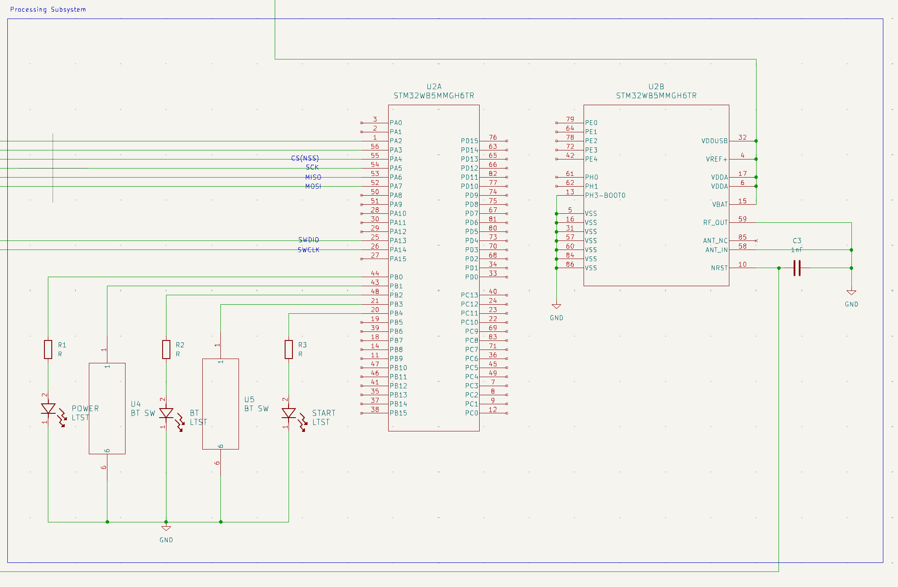
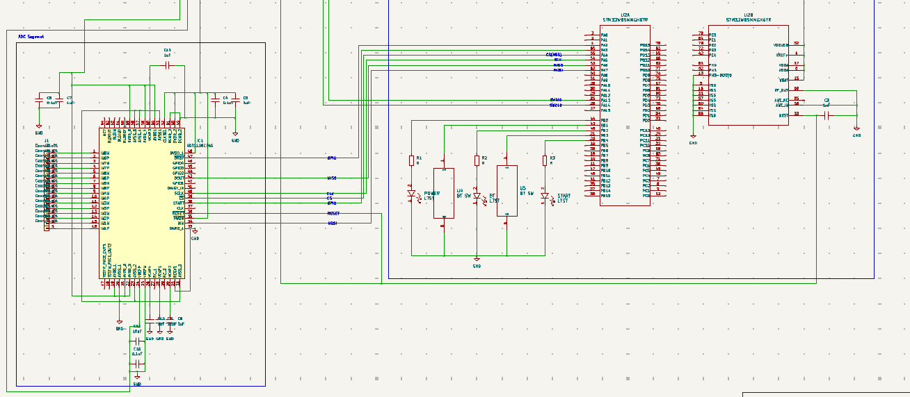
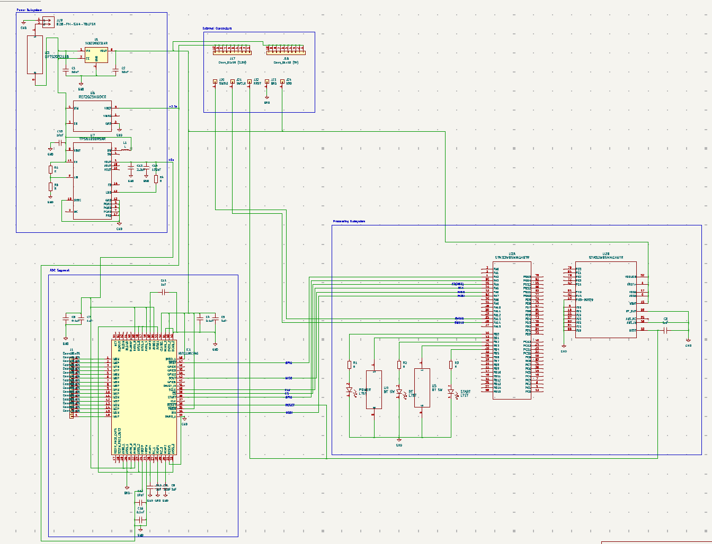
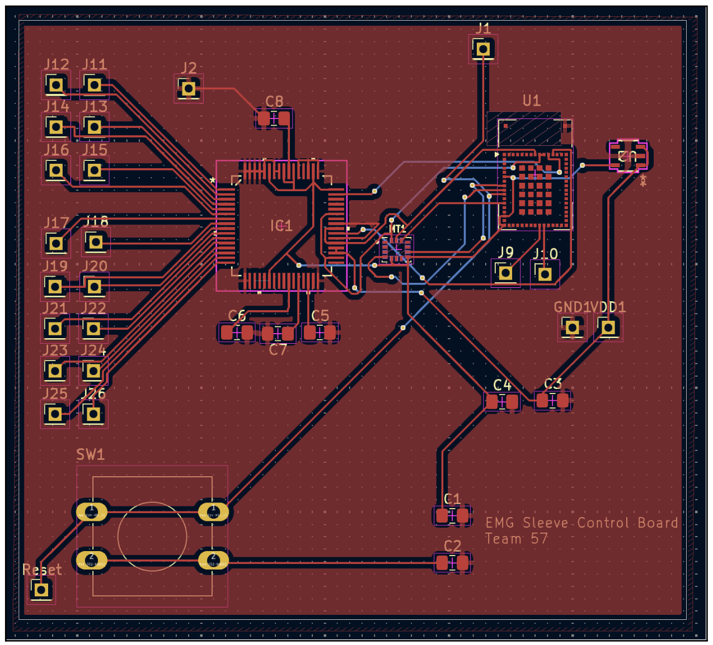
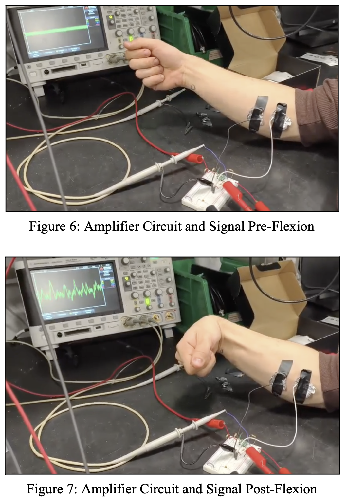
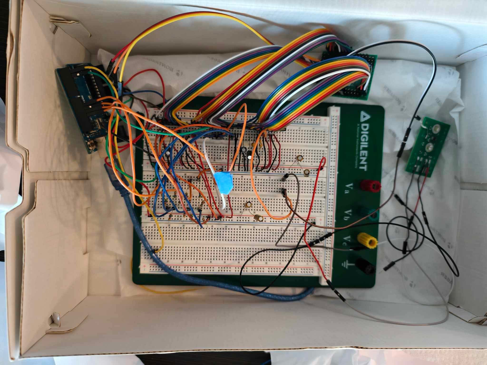
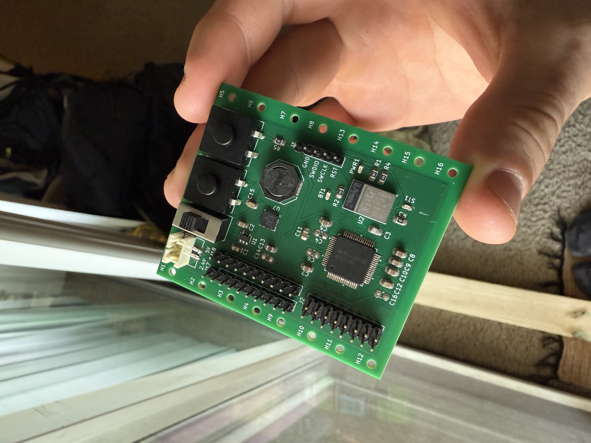

## Lab Notebook - Jameson Koonce
ECE 445 - Team 57
Wireless EMG sleeve for Hand Gesture Recognition

---

### Entry #1 - February 4th, 2025
We have decided to build a sleeve lined with EMG electrodes and an IMU sensor in order to classify a given user's hand gestures. We want to do this with the goal of making more immersive virtual reality environments.

To make this approachable, I think we should choose extremely distinct gestures which require the use of very different muscles in the forearm. For example,  we should have a position where the wrist is fully flexed forward and where the wrist is fully extended backwards. In this case, electrodes (on the top and bottom of the forearm) would pickup widely different signals.

As reference, through our research, a typical EMG signal ranges anywhere from 0-5mV where 5mV is on the extreme high end. Therefore, we would need to amplify this signal before processing. An example signal can be found below.

<!--  -->

Talking with the group, we would like to have a high classification accuracy, use the bluetooth protocol for classification, and have the device be battery powered.

---

### Entry #2 - February 12th, 2025

We solidified based on literature, that we would like to classify our final gestures with an accuracy around 70-80% on average. 

The STM32WB5MMG microcontroller was chosen because it has internal bluetooth capability and is programmed with the STM32  IDE, which is fairly common. 

Further, we have selected the ADS1198CPAG ADC to convert our amplified analog EMG signals to digital before it can be processed by our microcontroller. This ADC was chosen because it has 8 separate channels, so we can have 8 EMG signals recording at once, and specs that make it borderline medical grade. This is necessary because of the small amplitudes of EMG signals.

The ADC will further communicate with the MCU through SPI, and taking a look at the datasheet, there will be many configuration steps for the ADC given our setup. I think I will look into this process in the coming weeks, as I have also explored SPI in a previous course.

---

### Entry #3 - February 19th, 2025

We have decided to have 2 separate PCB designs for our project - an amplifier PCB, and a control board PCB. The amplifier PCB (there will be one for each EMG channel) will contain an op amp and analog filtering circuit to amplify the EMG signals. 

Taking a look at some sample op-amp circuits and thinking about the input range of our ADC (-2.5V - 2.5V range due to our 5V input), we were thinking of using an amplifier gain of around 200. In the scenario that an EMG signal reaches 10mV, this would be amplified to 2V, still within our maximum range. However, going slightly outside of this range will not be a problem according to the datasheet as well

The Control Board is the board composed of the MCU, the ADC, and any power modules. I have started the development of an overall control board schematic (see below). 

<!--  -->

The control board is shown with setup in accordance to the datasheet [found here](https://www.st.com/en/microcontrollers-microprocessors/stm32wb5mmg.html#overview). 

I have further added extraneous switches and LEDs hooked up to GPIO pins for general user operation - to be determined. 

---

### Entry #4 - February 26th, 2025

I have looked a lot more into our chosen ADC based on its datasheet [found here](https://www.ti.com/lit/ds/symlink/ads1198.pdf?HQS=dis-dk-null-digikeymode-dsf-pf-null-wwe&ts=1746743549147&ref_url=https%253A%252F%252Fwww.ti.com%252Fgeneral%252Fdocs%252Fsuppproductinfo.tsp%253FdistId%253D10%2526gotoUrl%253Dhttps%253A%252F%252Fwww.ti.com%252Flit%252Fgpn%252Fads1198) and have added the device to the schematic (image below).

<!--  -->

Of note, the device is powered by both 5V (as analog power) and 3.3V (as digital power). Further, the SPI connections (MISO, MOSI, CLK, CS) need to go to very specific MCU SPI pins as in the schematic. Further, the decoupling capacitors are places in accordance to recommendations by the datasheet.

I haven't yet looked into the coding side of things, but I'm hoping that SPI communication is essentially a library built into STM32.

---

### Entry #5 - March 5th, 2025

Today, we selected the XC6220 Voltage Regulator to get a 3.3V output from our 3.7V LIPO battery. Further, we selected the TPS61090 boost converter to get a 5V rail to power our amplifer and ADC. With this in mind I develped the final version of our control board schematic found below.

<!--  -->

Lastly, I developed the first version of our Control Board PCB which was just submitted for the PCB wave! This PCB is shown below.

<!--  -->

---

### Entry #6 - March 12th, 2025

Unfortunately, our team was slow to order parts, so our breadboard demo is going to be a little more sparse than we had hoped. That being said, the team has been hard at work testing amplifiers for our amplifier circuit, and we are going to demo a working visualization of EMG signal amplification.

Again, our circuit is based on a simple non-inverting op amp circuit with a gain of 200. A non-inverting circuit schematic can be found below.

<!--  -->

In this setup, the gain is equivalent to 1 + Rf/R2. Therefore, we have chosen Rf = 200kOhm and R2 = 1kOhm to achieve a gain of around 200.

NOTE: our actual breadboard demo has two electrodes (a reference and a recording) where both are amplified and the difference between them is taken to get our final reading. This is in accordance to a typical EMG process according to literature

Further, we needed to choose an op amp with a low enough offset voltage to pickup EMG signals from the forearm. Below you can find a chart of the op amps I tested (with SCOPY) before we finally tested in the lab.

<!--  -->

Building this circuit on a breadboard, we achieved the oscilloscope readings shown below. This successfully demonstrates analog EMG signals can be acquired, as they appear similar to the sample emg signals we were looking for.

<!--  -->

Above you can see I tested wrist flexion with the electrodes placed on the inner forearm (the flexed muscle). Before flexion, the signal was very flat with some small noise amplitudes. After flexion, you can see the expected amplitudes on the oscilloscope. Ready to demo!

---

### Entry #7 - April 1st, 2025

Unfortunately, our final control board PCB has yet to arrive, so I wanted to make sure we could have something to show, and begin development on the machine learning model. Therefore, this last week we took up the heavy task of recreating an exact model of our control board schematic on a breadboard. Further, because our partner has the devboard with the MCU, I wanted to try and acquire data on the device with an Arduino UNO as a proof of concept.

The final breadboard circuit can be found below.

<!-- 
 -->

Our ADS1198CPAG ADC had already arrived, so we were able to solder this onto a breakout board so we could attach it to the breadboard according to our schematic.

With so many wires, it was incredibly difficult to be precise on our breadboard. We made sure to triple check each of the wirings both on the breakout board and on the breadboard. 

We also used the 5V and 3.3V supplies out of the Arduino UNO to power the device as shown. That being said, we had to make some slight modifications from our schematic as follows:
- Add a 5V -> 3.3V voltage divider from DIN on the Ardiuno to MISO on the ADC
- Add a 5V -> 3.3V voltage divider from DOUT on the Ardiuno to MOSI on the ADC
- Add a 5V -> 3.3V voltage divider from CLK on the Ardiuno to CLK on the ADC
- Add a 5V -> 3.3V voltage divider from CS on the Ardiuno to CS on the ADC

These changes were necessary because the GPIO pins on the Arduino UNO output 5V when set high, however, the ADC can only take up to 3.3V (the digital supply). That being said, these are not changes are not necessary to the final circuit because the power to our chosen MCU is 3.3V so the GPIO pins will output 3.3V as expected.

As for the code, we used a preexisting Arduino library to interact wit our ADC using SPI. According to the datasheet, we made the following configurations for our setup:
- adjust register 1 to record 1k SPS out of channel 1
- enabled the 2.4 internal voltage reference
- disabled the default gain of 6 to have a gain of 1

<!--  -->

As inputs to the ADC, we setup our SCOPY oscilloscope to output a constant voltage at preselected intervals (and later a sine wave).

With this setup, we were able to successfully acquire as shown in the image below.

This is an extremely exciting test, because it shows that our initial schematic was correct and our PCB (which should arrive this upcoming Friday) should also work after soldering!

---

### Entry #8 - April 28th, 2025

With the final demo upcoming, we have made the following progress before this final session:
- Amplifier PCBs tested (4/8 working correctly)
- Model development using data acquired from Arduino
- Unfortunately, our final PCB did not work correctly after soldering and testing
- Sewn working Amplifier PCBs onto athletic sleeve to successfully acquire data

<!--  -->

Now, we simply wanted to bring everything together by connected our chosen MCU on the devboard to the premade breadboard circuit (essentially replacing the Arduino UNO with the STM32WB5MMG devboard).

I played a role in helping translate SPI interface code from Arduino to C on the STM32 IDE. Thankfully, there was a preexisting SPI interface library which made this code translation essentially 1-to-1. 

NOTE: We needed to remember to reverse the voltage dividers added between the SPI connections as before. We forgot to do this initially, which brought the 3.3V GPIO signals from the MCU down to 2.2V which was below the ADC digital input threshold.

Below you can find our final circuit for our Demo!

<!--  -->
